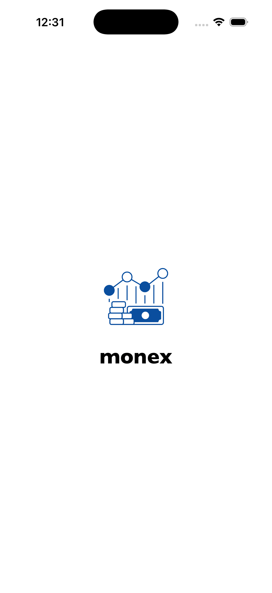
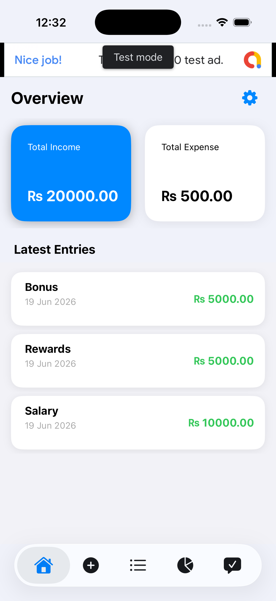
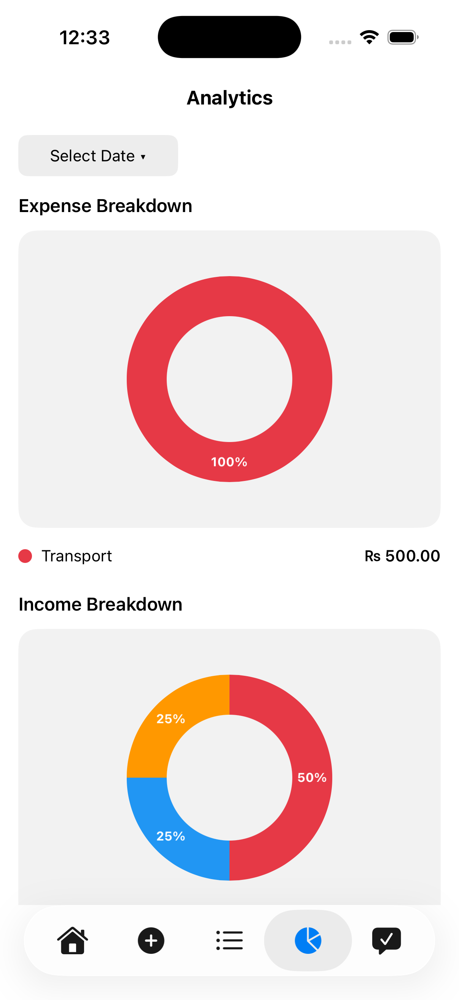
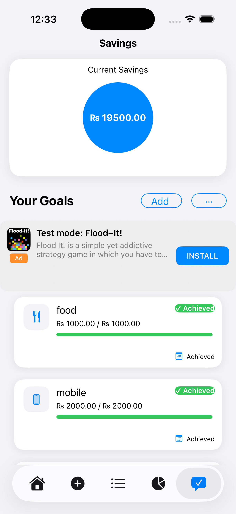
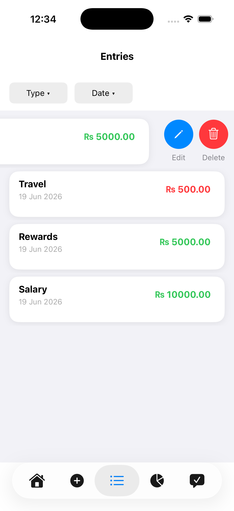
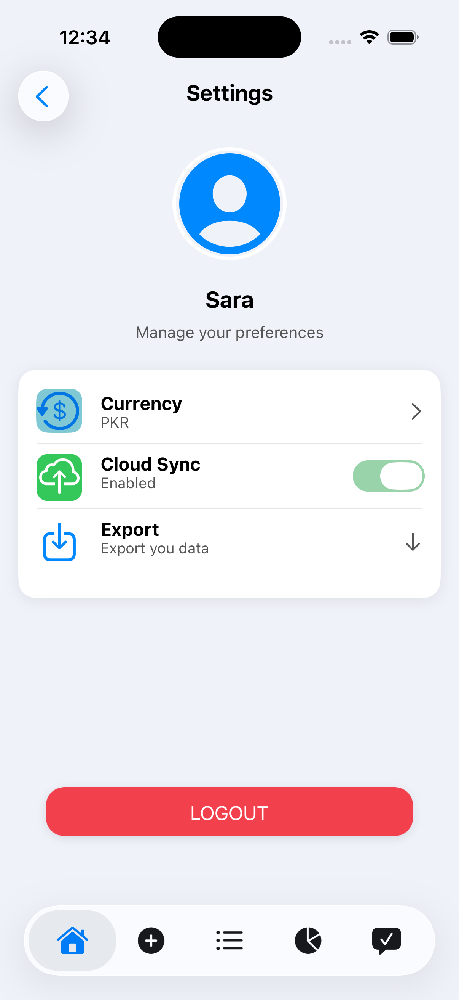

# Expense Manager

A full-featured personal finance app for tracking income, expenses, savings goals, and spending analytics — built with Swift and UIKit.

## Features

- 💰 **Income & Expense Tracking** — add entries with title, amount, category, date, and optional receipt/image
- 📊 **Analytics Dashboard** — visual donut-chart breakdowns of expenses and income by category
- 🎯 **Savings Goals** — set goals with target amounts, deadlines, and contribution frequency (monthly/yearly); track progress with visual bars and "Achieved" status
- 📁 **Entries Management** — filterable transactions list (by type/date) with edit and delete support
- 💱 **Multi-Currency Support** — switch between USD, EUR, PKR, INR, and AED with live conversion across the app
- ☁️ **Cloud Sync** — syncs expenses, categories, and goals to Firebase Firestore
- 📤 **Data Export** — export your financial data
- 👤 **User Profile & Settings**
- 🚀 **Onboarding flow** for first-time users

## Tech Stack

- **Swift** + **UIKit**
- **Core Data** for local persistence
- **Firebase Firestore** for cloud sync
- **AdMob** integration
- MVC architecture with organized module folders (Dashboard, Goals, Transactions, Settings, etc.)

## How It Works

1. **Add entries** — log income or expenses with category tags and optional receipts
2. **Track goals** — set savings targets with deadlines and monitor progress
3. **View analytics** — see spending patterns broken down by category
4. **Manage settings** — switch currency, enable cloud sync, export data anytime

## Getting Started

1. Clone the repo
```bash
   git clone https://github.com/SaraSamreen/ExpenseManager.git
```
2. Open `ExpenseManager.xcodeproj` in Xcode
3. Build and run on simulator or device

## Screenshots

   

   
